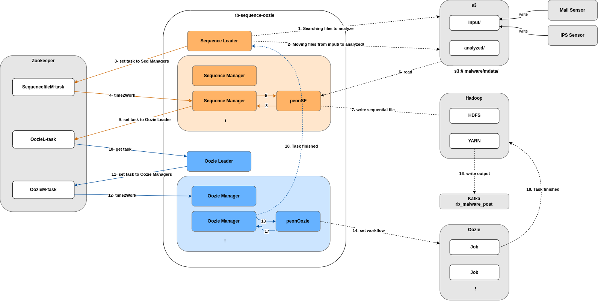
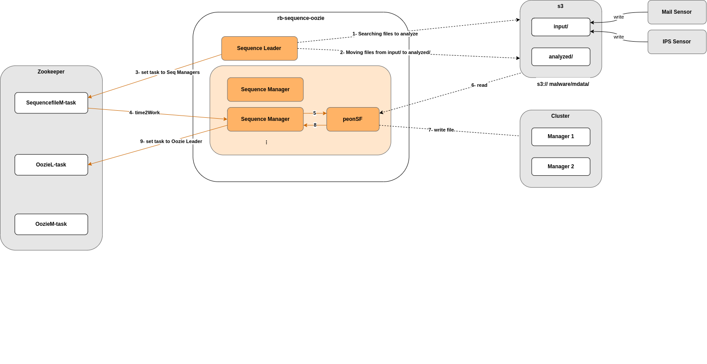

# rb-malware-sequencefile 

rb-malware-sequencefile is a Java distributed application used by RedBorder in the Malware Module 
to move files from S3 either to Hadoop (hdfs) or to Logstash (local directory). 

## Mode
As it is said before, this program send S3 files to two different places. This is done
selecting the mode in the config file. These modes are:
- Hadoop
- Logstash

### Hadoop Mode
**rb-sequence-oozie** is a distributed application that
consists of two parts. The first part, called **rb-sequence**, is in charge of obtaining
the files from rb-S3 and write them to Hadoop as a single sequential file. The second 
part, called rb-oozie, run the analysis jobs through the Oozie service.

Both parts are composed of three different elements: 
- **leader**
- **manager** 
- **peons**
  
In a rb-sequence-oozie cluster there is a rb-sequence leader and a
rb-oozie leader. It is available as many Managers as instances of the service, 
which will launch peons to create/parse files in HDFS.

Regarding the operation of the service, the files arrive at the rb-S3 path: 
**_s3://malware/mdata/input_**, coming from the IDS sensor or the Mail Gateway sensor.

#### rb-sequence
The Sequence Leader continually checks the rb-S3 paths: **_s3://malware/mdata/input/_**
and **_s3://malware/mdata/analyzed/_** looking for files to analyze (giving priority
to the analysis of the files in the **_input/_** folder). If there are files in the
**_input/_** folder (and they are selected to be analyzed), the Sequence Leader passes
these to the folder **_analyzed/_**.

The Sequence Leader will select a maximum of the number of files (defined in the 
configuration file). Once it has selected them, it writes a task in Zookeeper indicating
which files have to be be analyzed; this task is assigned to a Sequence Manager that 
will execute a Sequence Peon. This Peon downloads the rb-S3 files that the Sequence Leader
selected, merges them creating a single sequential file and uploads them to Hadoop's HDFS.

The Sequence Manager writes then a task in Zookeeper, which will be received by the second
part of the program, the Oozie Leader, so that the new sequential file is analyzed. 
Here ends the first part of the service rb-sequence-oozie.

#### rb-oozie
At this point the second part begins. The Oozie Leader passes this task to an 
OozieManager leaning again on Zookeeper. The Oozie Manager creates an Oozie peon,
which implements a client of the Oozie service. This client is in charge of carrying
out the analysis (determined by the workflow to be executed). The peon sends the job
to Oozie and once it is received by the Oozie server, it executes the tasks in the
Hadoop YARN.

When the analysis ends, a semaphore is released from the Sequence Leader so that it 
returns to select new files to be analyzed and repeat the entire process above
mentioned.

### Logstash Mode
This second mode only uses the first part of **rb-sequence-oozie**. So it takes the files
from rb-S3 and write them to the different managers in the cluster than are running Logstash.

Once it is done, the semaphore is released from the Sequence Leader so that it
returns to select new files to be analyzed and repeat the process above mentioned.
